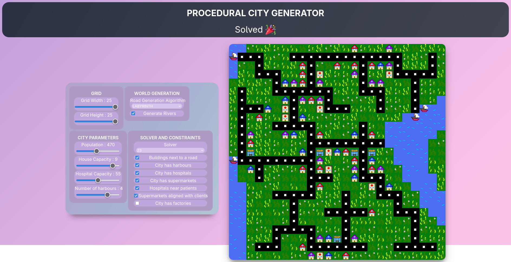

# Génération de ville sous contraintes

Ce projet consiste à générer une ville en 2D en respectant un ensemble de contraintes paramétrables.



## Utilisation

### Installation des dépendances

> Il est recommandé d’utiliser un environnement virtuel (`venv`)

```bash
pip install -r requirements.txt  
```

### Lancement de l'application

```bash
python -m sims.main
```

L’interface web sera accessible à l’adresse suivante : [http://localhost:8000](http://localhost:8000)

## Solveurs

Ce projet utilise **Z3** et **OR-Tools** pour la résolution des contraintes.  
Des paramètres spécifiques peuvent être configurés pour chaque solveur.

## Documentation

Un notebook Jupyter est disponible dans le dossier `assets` pour présenter les différentes étapes du projet ainsi que les choix d’implémentation.

Les slides de la présentation sont également dans le dossier `assets`.
